class: middle

# Galaxy ToolShed
## Sharing Galaxy tools

### EGDW 2017

<!-- Slides by Stéphanie Le Gras<br/> -->

.footer[
https://github.com/igbmc/egdw2017
]

---

layout: true
name: title
class: middle

.footer[
EGDW 2017
]

---

layout: true
name: content

.footer[
EGDW 2017
]

---

template: title

## Welcome!

.image20[]

The easiest way to **navigate** this slide deck
is **by hitting `[space]` on your keyboard**

You can also navigate with arrow keys, but be careful because some
slides can be nested inside of each other (vertically)

---

template: content

#  Questions

- What is a Tool Shed?
- How to install tools and workflows from a Tool Shed into a Galaxy instance?
- What are the Tool Shed repository types?
- How to publish with Planemo?

---
template: content

# Objectives

- Discover what is a Tool Shed
- Be able to install tools and workflows from a Tool Shed into a Galaxy instance
- Be able to publish tools with Planemo

---
template: content

# What is a Tool Shed?


---
template: content

#  = Galaxy App Store

---
template: content

#  = Galaxy App Store
- Galaxy tools
- ~~Recipes for installing and compilling tools~~,
- Data Managers,
- Custom datatypes,
- Exported workflows.

---
template: content

#  = Galaxy App Store

- For Galaxy administrators, facilitates:
  - **installing/updating** tools

- For tool developers, facilitates:
  - **sharing** of Galaxy utilities
  - **versioning**

---
template: content

# Available Tool Sheds
- [Galaxy community Tool Shed](https://toolshed.g2.bx.psu.edu/) -> Main Tool Shed
- [Galaxy community test Tool Shed](https://testtoolshed.g2.bx.psu.edu/) -> Sandbox for testing
- [List of public Tool Sheds](https://wiki.galaxyproject.org/PublicGalaxyServers#Public_ToolSheds)

---
template: content

# Tool Shed interface
.image[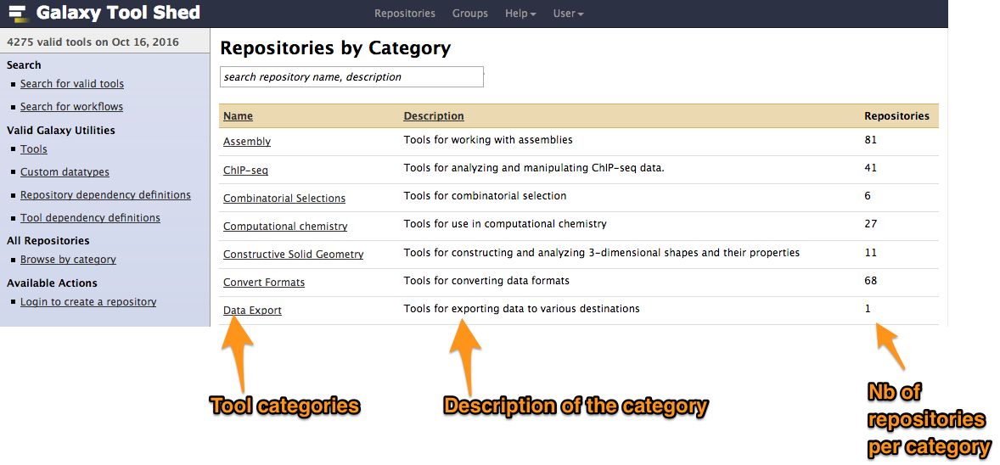]

---
template: content

# Example of tool
.image60[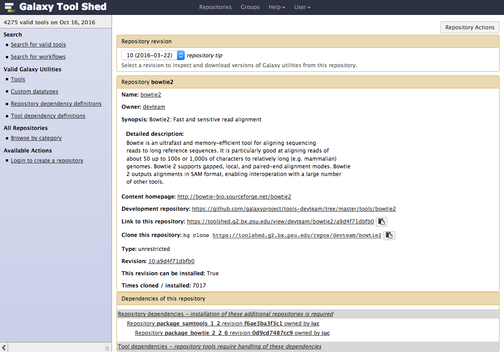]

---
template: content
# Before moving on let's make things working
## Hands-on
- Go to Galaxy sources
```bash
cd ~/galaxy
```
- Start your toolshed (in galaxy home directory):
```bash
./run_tool_shed.sh
```

---
template: title

<!-- INSTALLING TOOLS FROM A TOOLSHED -->
# Installing tools from a Tool Shed

---
template: content

# Connect your Galaxy to a Tool Shed
- Connect your Galaxy to a Tool Shed in `config/tool_sheds_conf.xml`:
```bash
  <tool_sheds>
    <tool_shed name="Galaxy main tool shed" url="https://toolshed.g2.bx.psu.edu/" />
  </tool_sheds>
```
- Restart Galaxy

---
template: content

# Keep default dependencies resolution
  - in `config/galaxy.ini`:
```txt
conda_prefix = <tool_dependency_dir>/_conda
conda_auto_install = False
conda_auto_init = False
```
  - in `config/dependency_resolvers_conf.xml` (order matters):
```xml
<dependency_resolvers>
      <tool_shed_packages />
      <galaxy_packages />
      <galaxy_packages versionless="true" />
      <conda />
      <conda versionless="true" />
</dependency_resolvers>
```

---
template: content

# Install a tool from the Tool Shed
- Go to the admin interface and click on "Search Tool Shed"
.image[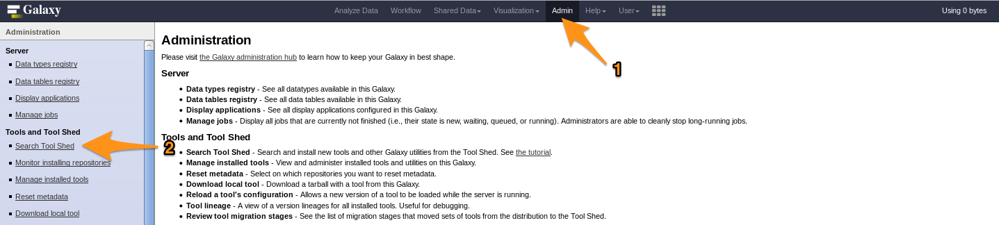]
<br/>
- Select a Tool Shed
.image[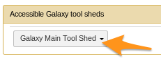]

---
template: content

# Install a tool from the Tool Shed
- Search your tool
.image80[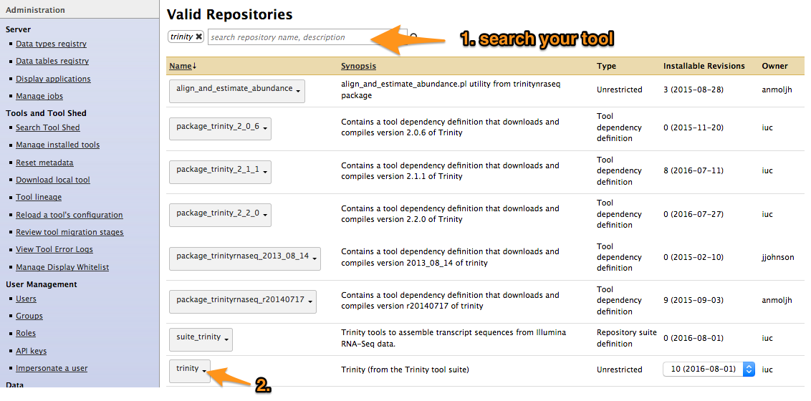]

---
template: content

# Install a tool from the Tool Shed
- Types of repository</span>
  - <span style="color:orange"> Tools (`$name`)</span>
  - <span style="color:blue"> Tool suites (`suite_$name`)</span>
  - <span style="color:red"> Tool dependencies (`package_$name_$version`)</span> (gradually removed, replaced by Conda dependencies)
.image80[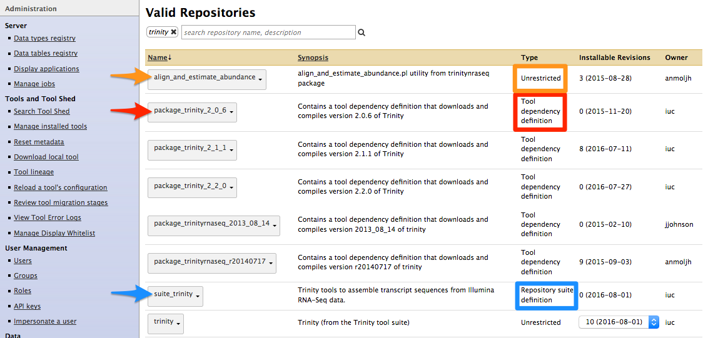]

---
template: content

# Install a tool from the Tool Shed
-
.image[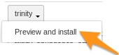]
- Install the tool
.image[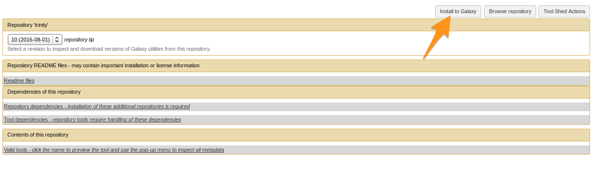]

---
template: content

# Install a tool from the Tool Shed
- Install the tool
.image[]
- Selecting Tool Shed AND conda will make Galaxy to install both
- Recommended: use conda

---
template: content

# Install a tool from the Tool Shed
- Check
.image[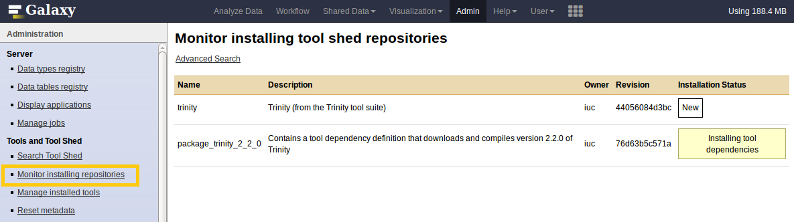]

---
template: content

# Manage installed tools
- Admin > Manage installed tools
.image80[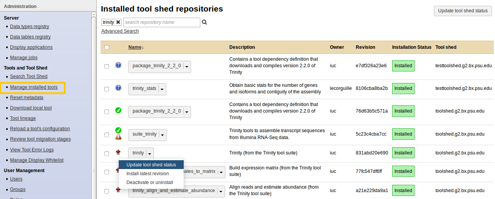]
.image80[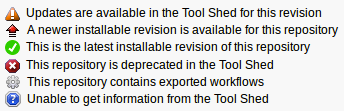]

---
template: content

# Manage installed tools
- Click on the name of a tool
  - Manage and browse the repository
.image60[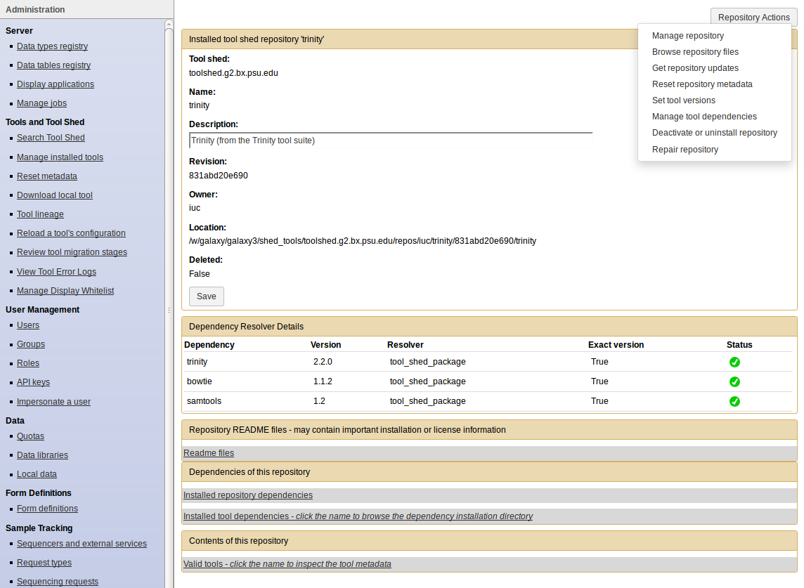]
---
template: title

# Tips: How to install workflows

---

#  How to install a workflow?
- Admin > Search Tool Shed
- Search the workflow
  1. .image80[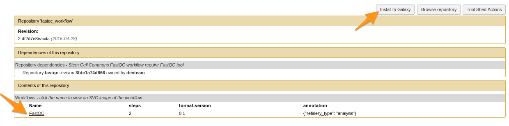]
  2. .image80[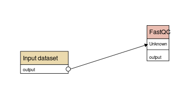]
- Tools can come with the workflow if they are not yet installed

---
template: content

# How to install a workflow?
.image[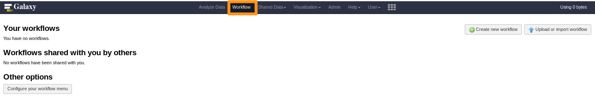]
- No workflow?

---
template: content

#  How to install a workflow?
.image[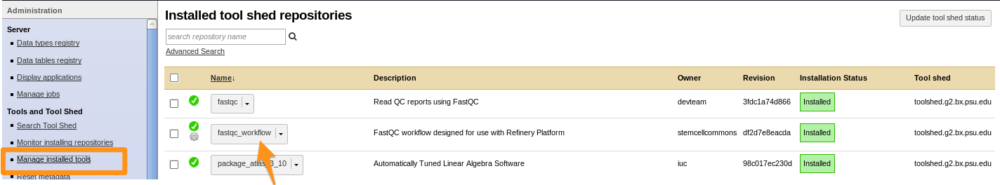]
- Click on the imported workflow

---
template: content

#  How to install a workflow?
.image80[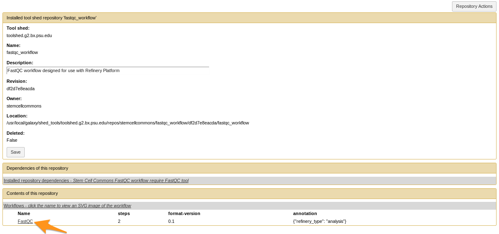]
- Click on the workflow at the bottom of the “Contents of this repository” section

---
template: content

#  How to install a workflow?
- Repository Actions > Import workflow to Galaxy
.image80[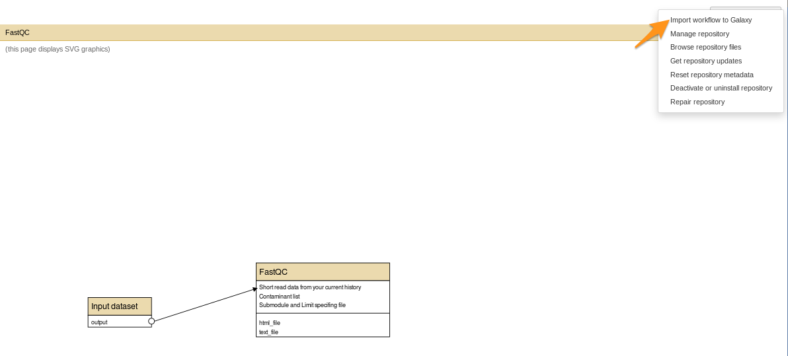]

---
template: content

#  How to install a workflow?
.image80[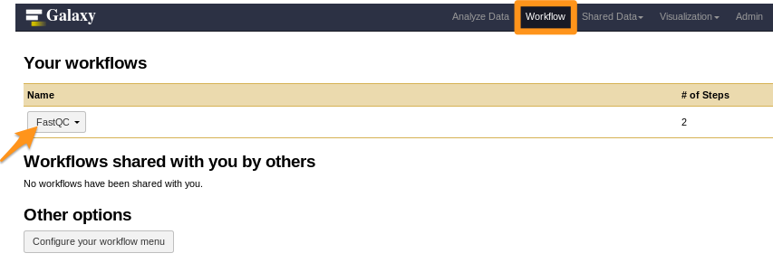]
- Done!

---
template: title

# Tool Shed repository types

---
template: title

# Tool Shed repository types
## Tool with dependencies

---
template: content

# Tool with dependencies
.image[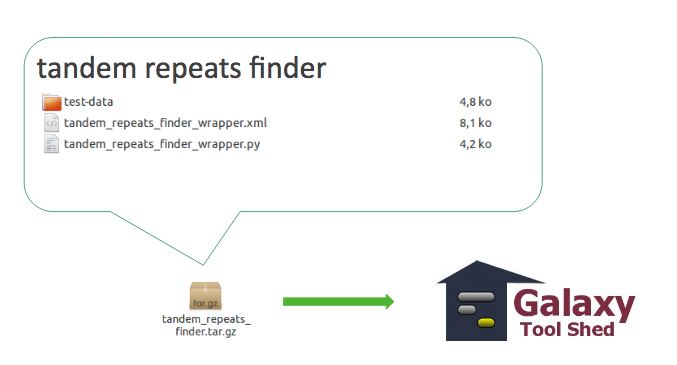]

---
template: content

# Tool with dependencies
- Report the requirement in your wrapper in order to **load environment with Conda**
`tandem_repeats_finder_wrapper.xml`
```xml
<requirements>
  <requirement type="package" version="4.0">tandem_repeats_finder</requirement>
</requirements>
```

---
template: title

# Tool suite
## Relationship between required repositories

---
template: content

#  Tool suite
.image[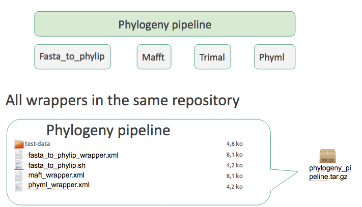]
- Works but...

---
template: content

#  Tool suite
.image[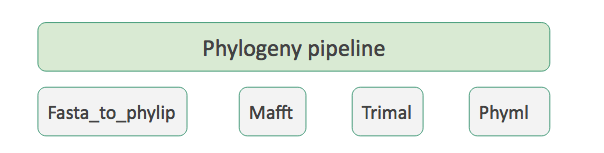]
- One tool per repository

- How to link tools ?
  - To install them together

---
template: content

#  Tool suite
- Repository dependencies
  - relationship between a dependent repository and one or more required repository (tools, datatypes, workflows,...)
  - -> One file
```xml
<?xml version="1.0"?>
<repositories description="Pipeline phylogeny">
   <repository toolshed="http://testtoolshed.g2.bx.psu.edu"
     name="fasta_to_phylip" owner="gandres" changeset_revision="a895633568" />
   <repository name="mafft" owner="gandres" />
   <repository name="phyml" owner="gandres" />
[…]
</repositories>
```

---
template: content

#  Tool suite
.image[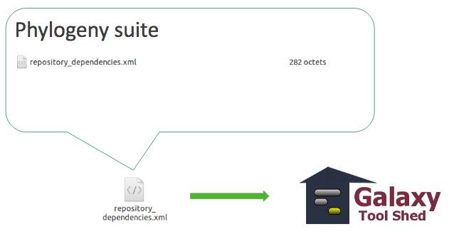]

---
template: content

#  Tool suite
```xml
<?xml version="1.0"?>
<repositories description="Pipeline phylogeny">
   <repository name="mafft" owner="gandres" />
</repositories>
```
.image[]
```xml
<?xml version="1.0"?>
<repositories description="Pipeline phylogeny">
   <repository name="mafft" owner="gandres" toolshed=
"http://testtoolshed.g2.bx.psu.edu" changeset_revision="a895633568"/>
</repositories>
```

---
template: content

# Tool suite
- New tool version
  - Latest version is no longer **changeset_revision="a895633568**
  - Reload `repository_dependencies.xml` file in your repository

---
template: title

# Workflow

---
template: content

#  Workflow
.image[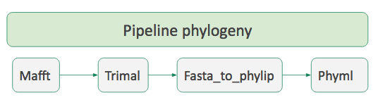]
- How to order tools ?

---
template: content

#  Workflow
- In galaxy

.image60[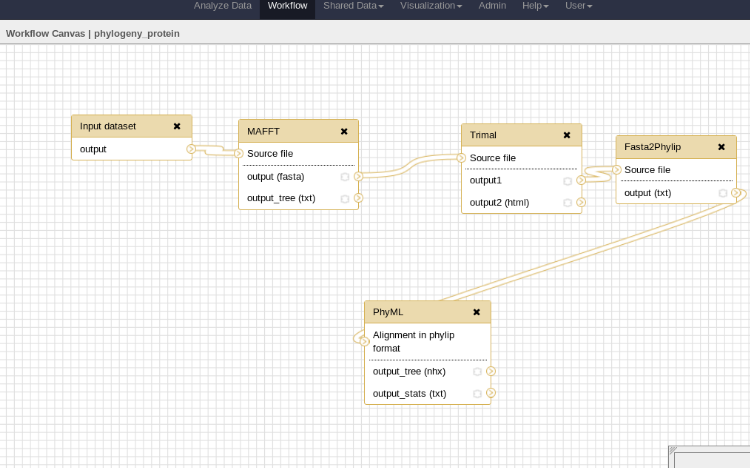]

---
template: content

#  Workflow
.image[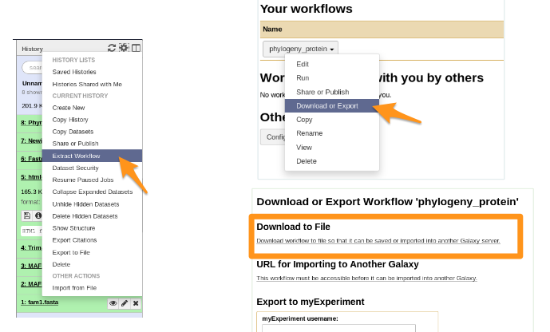]
- You get a file: Galaxy-Workflow-NAME.ga

---
template: content

#  Workflow
- You have your file Galaxy-Workflow-NAME.ga
- How to automatically import all tools?
  - -> `repository_dependencies.xml`
```xml
<?xml version="1.0"?>
<repositories description="Phylogeny workflow">
   <repository name="suite_phylogeny" owner="galaxy" />
</repositories>
```

---
template: content

#  Workflow
.image[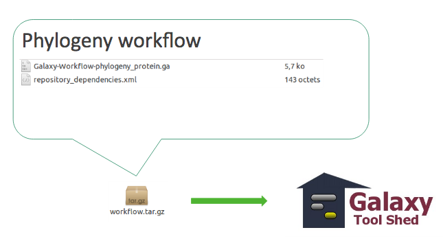]

---
template: content

#  Workflow
.image[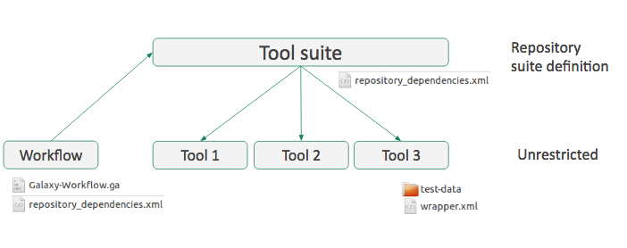]
- **Everything must be on the same toolshed**

---
template: title

# Tips
## What about tools working with \*.loc files or new datatypes

---
template: content

# Tools with `*.loc` files or new datatypes
- add them to the Tool Shed repository.

- `*.loc` files and `datatypes` files should be provided as `*.sample` file in a `tool-data` directory.

- `tool-data/*.loc.sample` files come along with `tool_data_table_conf.xml.sample`.
Their content or the file themselves are put to the right location on tool set up.

---
template: content

# Tools with \*.loc files or new datatypes
.image60[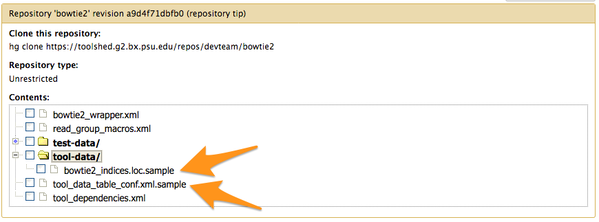]
- `tool_data_table_conf.xml.sample`
```xml
<tables>
  <!-- Locations of indexes in the Bowtie2 mapper format -->
  <table name="bowtie2_indexes" comment_char="#">
    <columns>value, dbkey, name, path</columns>
    <file path="tool-data/bowtie2_indices.loc" />
  </table>
</tables>
```
- On install, the content of the file and the right
path to the \*.loc file is added to `shed_tool_data_table_conf.xml`

---
template: title

<!-- PUBLISHING WITH PLANEMO -->
# 4. Publishing with Planemo

---
template: content
# Configure the target Tool Shed
```bash
planemo config_init
```
- Creates `.planemo.yml` file in your home directory:

```yml
## Planemo Global Configuration File.
## Everything in this file is completely optional - these values can all be
## configured via command line options for the corresponding commands.
## [...]
sheds:
     toolshed:
           #key: "<TODO>"
           #email: "<TODO>"
           #password: "<TODO>"
     testtoolshed:
           #key: "<TODO>"
           #email: "<TODO>"
           #password: "<TODO>"
     local:
           #key: "<TODO>"
           #email: "<TODO>"
           #password: "<TODO>"
```

---
template: content

# Configure the target Tool Shed                            
- Add your Tool Shed API key in `.planemo.yml`

```yml
## Planemo Global Configuration File.
## Everything in this file is completely optional - these values can all be
## configured via command line options for the corresponding commands.
## [...]
sheds:
     toolshed:
           key: "xxxxxxxxxmytoolshedAPIkeyxxxxxxx"
           #email: "<TODO>"
           #password: "<TODO>"
     testtoolshed:
           #key: "<TODO>"
           #email: "<TODO>"
           #password: "<TODO>"
     local:
           #key: "<TODO>"
           #email: "<TODO>"
           #password: "<TODO>"
```
---
template: content

# Configure repository
```bash
planemo shed_init --name="tandem_repeats_finder_2"
                     --owner="gandres"
                     --description="Tandem Repeats Finder description"
                     --long_description="A long long description."
                     --category="Sequence Analysis"
                     [--remote_repository_url=<URL to .shed.yml on github>]
                     [--homepage_url=<Homepage for tool.>]
```
- Creates `.shed.yml` file in the current repository (tool repository):

```xml
categories: [Sequence Analysis]
description: Tandem Repeats Finder description
long_description: A long long description.
name: tandem_repeats_finder_2
owner: gandres
```

---
template: content

# Configure repository
## Naming conventions

| Repository Type | Recommended Name         | Examples                 |
| --------------- |--------------------------| -------------------------|
| Data Managers   | `data_manager_$name`     | `data_manager_bowtie2`   |
| Packages        | `package_$name_$version` | `package_aragorn_1_2_36` |
| Tool Suites     | `suite_$name`            | `suite_samtools`         |
| Tools           | `$name`                  | `stringle`, `bowtie2`    |

Planemo will determine the repository type based on these conventions</span>

---
template: content

# Configure repository
- Tools and tool suite `.shed.yml`: implicitly define repositories for each individual tool in the directory and build a suite for those tools.

- Example: `trinity/.shed.yml`

```xml
[...]
auto_tool_repositories:
    name_template: "{{ tool_id }}"
    description_template: "{{ tool_name }} (from the Trinity tool suite)"
suite:
    name: "suite_trinity"
    description: Trinity tools to assemble transcript sequences from Illumina RNA-Seq data.
```

---
template: content

# Check
```bash
planemo shed_lint --tools
```
```bash
Linting repository […]/tandem_repeats_finder
Applying linter expansion... CHECK
.. INFO: Included files all found.
Applying linter tool_dependencies_xsd... CHECK
.. INFO: tool_dependencies.xml found and appears to be valid XML
Applying linter tool_dependencies_actions... CHECK
.. INFO: Parsed tool dependencies.
Applying linter repository_dependencies... CHECK
.. INFO: No repository_dependencies.xml, skipping.
Applying linter shed_yaml... CHECK
.. INFO: .shed.yml found and appears to be valid YAML.
Applying linter readme... CHECK
.. INFO: No README found skipping.
+Linting tool […]/tandem_repeats_finder/tandem_repeats_finder_wrapper.xml
[…]
```

---
template: content
# Create repository

```bash
planemo shed_create --shed_target testtoolshed
```
- Don't forget **--shed_target**. Default is main toolshed

---
template: content

# Create repository
```bash
planemo shed_create --shed_target testtoolshed
```
```bash
Repository created
cd '[…]/tandem_repeats_finder' && git rev-parse HEAD
Repository tandem_repeats_finder_2 updated successfully.
```
.image60[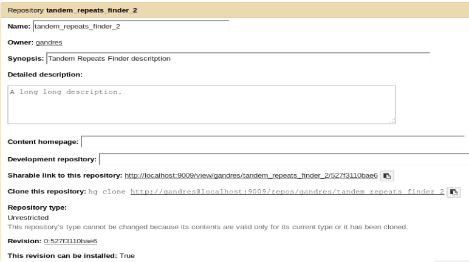]

---
template: content

# Update repository
```bash
planemo shed_diff --shed_target testtoolshed

```
```bash
wget -q --recursive -O - 'https://testtoolshed.g2.bx.psu.edu/repository/download?repository_id=6306166e4da9a8bf&changeset_revision=default&file_type=gz' | tar -xzf - -C /tmp/tool_shed_diff_DMcOrR/_testtoolshed_ --strip-components 1
mkdir "/tmp/tool_shed_diff_DMcOrR/_local_"; tar -xzf "/tmp/tmp5ousfg" -C "/tmp/tool_shed_diff_DMcOrR/_local_"; rm -rf /tmp/tmp5ousfg
cd "/tmp/tool_shed_diff_DMcOrR"; diff -r _local_ _testtoolshed_
diff -r _local_/tandem_repeats_finder.xml _testtoolshed_/tandem_repeats_finder.xml
41d40
<     <param name="fileout_label2" type="text" value="Unused" label="none" help="Output name for files" />
```
- Need to be updated

---
template: content

# Update repository
```bash
planemo shed_update --check_diff --shed_target testtoolshed

```
```bash
wget -q --recursive -O - 'https://testtoolshed.g2.bx.psu.edu/repository/download?repository_id=6306166e4da9a8bf&changeset_revision=default&file_type=gz' | tar -xzf - -C /tmp/tool_shed_diff_DMcOrR/_testtoolshed_ --strip-components 1
mkdir "/tmp/tool_shed_diff_DMcOrR/_local_"; tar -xzf "/tmp/tmp5ousfg" -C "/tmp/tool_shed_diff_DMcOrR/_local_"; rm -rf /tmp/tmp5ousfg
cd "/tmp/tool_shed_diff_DMcOrR"; diff -r _local_ _testtoolshed_
diff -r _local_/tandem_repeats_finder.xml _testtoolshed_/tandem_repeats_finder.xml
41d40
<     <param name="fileout_label2" type="text" value="Unused" label="none" help="Output name for files" />
Repository tandem_repeats_finder updated successfully.
Repository metadata updated.
```
- Tool updated

---
template: content  

# Update repository
```bash
planemo shed_update --check_diff --shed_target testtoolshed

```
.image60[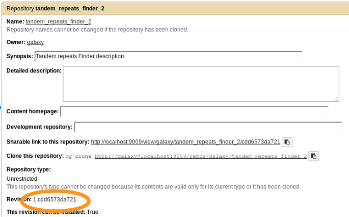]
- Tool updated

---
template: content

.image20[]
# Publishing to the Tool Shed

.image[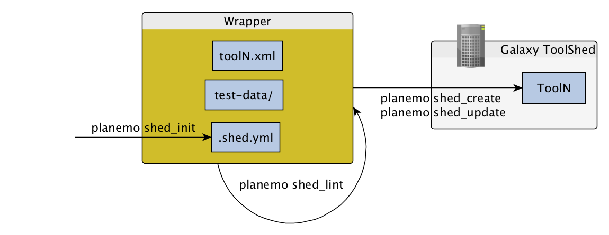]

---
template: title

<!-- PLANEMO -->
.image60[]

 Command-line utilities to assist in building and publishing Galaxy tools.

---
template: content

.image20[]

.image60[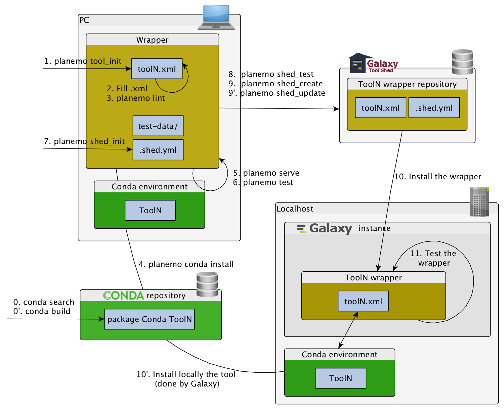]

---
template: content

.image20[]

# Checklist (3/3)


<input type="checkbox"/> Initiate the `.shed.yml` file with <br/>
`planemo shed_init` <br/>
<input type="checkbox"/> Create the repository on ToolShed with <br/>
`planemo shed_create`<br/>
<input type="checkbox"/> Install and test the wrapper on a Galaxy instance <br/>
<input type="checkbox"/> Improve the wrapper and push modification on toolshed <br/>
`planemo shed_update` <br/>


---
template: content

<!-- REFERENCES -->
# References
- [ToolShed](https://wiki.galaxyproject.org/ToolShed/Tour)
- [Install tools from the ToolShed](https://wiki.galaxyproject.org/Admin/Tools/AddToolFromToolShedTutorial)
- [Publish tools with Planemo](https://planemo.readthedocs.io/en/latest/publishing.html)

---
template: title

<!-- HANDS-ON -->
# Hands-on

.image20[]

---
template: title
#  Hands-on

## The goal
Publish your tool (seqtk_seq) in your local toolshed with Planemo
---
# Hands-on

## Step 1: Start and configure your toolshed (1/2)
- Start your toolshed (in galaxy home directory):
```bash
./run_tool_shed.sh
```
- Toolshed available at `http://localhost:9009`
- Create a new user (Login: galaxy@localhost.fr / password: azerty)
  - Go to `http://localhost:9009`
  - Click on User/register

---

## Step 1: Start and configure your toolshed (2/2)

- Move the config file to a non sample one
```bash
mv config/tool_shed.ini.sample config/tool_shed.ini
```
- Make the galaxy user admin
  - edit the file `config/tool_shed.ini`

```xml
admin_users = galaxy@localhost.fr
```

- Re-Start the toolshed
- Login to the toolshed (Login: galaxy@localhost.fr / password: azerty)
- Create a category named "Fasta Manipulation"
  - Go to Admin > manage categories
  - click on Add new category

---

# Hands-on

## Step 2: Use planemo to publish your tool

---

# Hands-on

## Step 2: Use planemo to publish your tool
- `planemo config_init`
- `planemo shed_init` (category="Fasta Manipulation")
- `planemo shed_lint`
- `planemo shed_create`


<!--
# Hands-on

## Step 2: Use planemo to publish your tool (2/2)

```bash
planemo config_init
```
  - Creates file `.planemo.yml` in your home directory.
```xml
[...]  local:
#key: "<TODO>"
email: "galaxy@localhost.fr"
password: "azerty"
```

```bash
planemo shed_init --name=seqtk_seq --owner=galaxy --description="common transformation of FASTA/Q" --category="Fasta Manipulation"
```
```bash
planemo shed_lint .
```
```bash
planemo shed_create --shed_target local
```
-->

---
template: hands-on

# Hands-on

## Step 3: Update your tool and then use planemo to update your tool on the Tool Shed

---
# Hands-on

##  Step 3: Update your tool and then use planemo to update your tool on the Tool Shed
- `planemo shed_diff`
- `planemo shed_update`

<!--
<aside class="notes">
```bash
planemo shed_diff --shed_target local
```
```bash
planemo shed_update --check_diff --shed_target local
``` -->

---
<!-- CONCLUSION -->

# Key points

- Use Planemo
- Contribute to the Main Tool Shed
