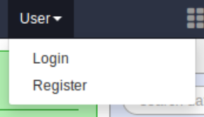
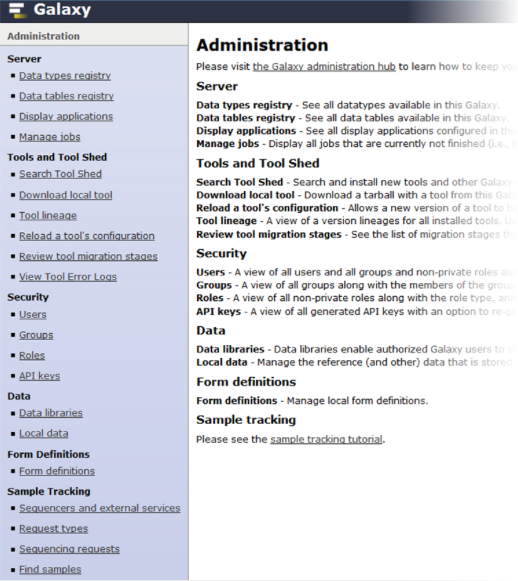

class: middle

# Become a master of Galaxy
## Adminitration of Galaxy
.center.smallimage[]

## EGDW 2017

Slides by Stéphanie Le Gras<br/>
Inspired by Galaxy Administrator Courses from [Dagobah](https://github.com/martenson/dagobah-training)

.footer[
https://github.com/igbmc/egdw2017
]

---

layout: true
name: title
class: middle

.footer[
EGDW 2017
]

---

layout: true
name: content

.footer[
EGDW 2017
]

---

layout: true
name: hands-on

.footer[
EGDW 2017 - **Hands-on**
]

---
template: content

# Make yourself an administrator

* Create a user using Galaxy interface
.center.verysmallimage[]

* Modify `galaxy.ini` to include `admin_users = your@ema.il`
* (Re)start Galaxy
```shell
$ GALAXY_RUN_ALL=1 ./run.sh --daemon
```

---
template: content

# Admin interface
 * Visualize data types and data tables
 * Manage jobs
 * Install tools using the Tool Shed
 * Reload a tool wrapper (after some modifications)
 * Manage users, quotas and groups
 * Use data managers
 * Manage data libraries (shared data)
.center.image[]
