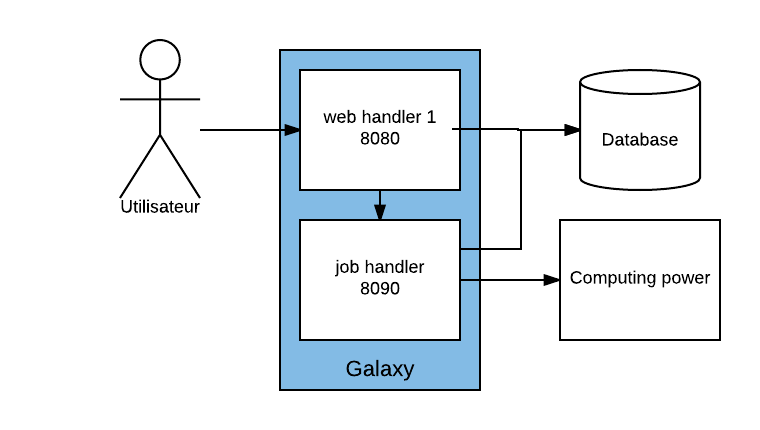

class: middle

# Galaxy Handlers

## EGDW 2017

Slides by Julien Seiler<br/>
Inspired by Galaxy Administrator Courses from [Dagobah](https://github.com/martenson/dagobah-training)

.footer[
https://github.com/igbmc/egdw2017
]

---

layout: true
name: title
class: middle

.footer[
EGDW 2017
]

---

layout: true
name: content

.footer[
EGDW 2017
]

---

layout: true
name: hands-on

.footer[
EGDW 2017 - **Hands-on**
]

---

template: content

# Please interrupt!

Your questions will be answered

# Set your post-it!

**Post-it on** = Still working hard on it<br/>
**Post-it removed** = I did it!

---

# Web handlers vs Job handlers

Galaxy is a web application that uses handlers to perform actions.

There are two main types of actions that are carried out by handlers:
- Respond to user requests; These actions are carried out by **web handlers**
- Manage the execution of tools; These actions are performed by **job handlers**.

By default, Galaxy is configured to run a single handler that handles both user queries and jobs.

Depending on the number of users accessing your Galaxy instance or the number of jobs you need to manage you may need to start web handlers or additional job handlers.

---

# Sample architecture with two handlers

For a classical Galaxy instance we declare at least one handler dedicated to the execution of the jobs. This will allow us to separate the log specific to the execution of the tools and log about the actions of the user on the web interface.

Here is the configuration we would like to set up :

.center[]

---

template: hands-on

# Declare a new handler that will listen on port `8090`

In your `config/galaxy.ini` file, add the following lines at the end of the HTTP server section (line 50)

```ini
[server:job]
use = egg:Paste#http
port = 8090
use_threadpool = True
threadpool_kill_thread_limit = 10800
```

This section defines a new handler that will be launched by the `run.sh` script.

.pure-table.pure-table-bordered.smaller-font[
Parameter | Description
--- | ---
use = egg:Paste#http | The type of engine used to run this handler
port = 8090 | The handler will listen on port 8090
use_threadpool = True | Uses a limited number of threads (10 by default) for this handler. Each thread handles one request at a time.
threadpool_kill_thread_limit = 10800 | The number of seconds a thread can run before being killed automatically (3 hours)
]

Those parameters are specific to Paste. In production we now use **uwsgi** and **supervisord** to run and manage Galaxy handlers processes.

---

# Re-run your instance in daemon mode

If your Galaxy instance is still running, stop it with the `Ctrl + c` key sequence

```shell
[galaxy]$ GALAXY_RUN_ALL=1 ./run.sh --daemon
```

Your Galaxy instance now works with two handlers: one on port `8080` and one on` 8090` port

--

# Check your logs

```shell
[galaxy]$ tail -f main.log
[galaxy]$ tail -f job.log
```

Two Galaxy servers have been launched and you can access each of them using the corresponding port. Both servers have the same view of your data or jobs.

---

# Create a job configuration file using the basic sample provided by Galaxy

```shell
[galaxy]$ cp config/job_conf.xml.sample_basic config/job_conf.xml
```

---

# Declare a new handler as a job handler based on the local job launcher

Edit your `job_conf.xml` file as follows :

```xml
<?xml version="1.0"?>
<job_conf>
    <plugins>
        <plugin id="local" type="runner" load="galaxy.jobs.runners.local:LocalJobRunner" workers="1"/>
    </plugins>
    <handlers>
        <handler id="job"/>
    </handlers>
    <destinations>
        <destination id="local" runner="local"/>
    </destinations>
</job_conf>
```

---

# Activate your job configuration in your `galaxy.ini` file

```ini
job_config_file = config/job_conf.xml
```

--

# Re-launch your Galaxy instance

```shell
[galaxy]$ GALAXY_RUN_ALL=1 ./run.sh --stop-daemon
[galaxy]$ GALAXY_RUN_ALL=1 ./run.sh --daemon
```

---

# Re-run the **Change case** tool on your Galaxy instance and check which handler is running the job

.center[]

```shell
[galaxy]$ tail -f job.log
```
