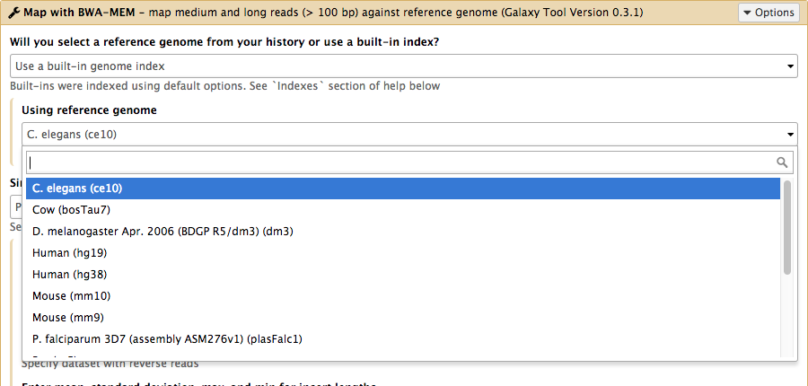
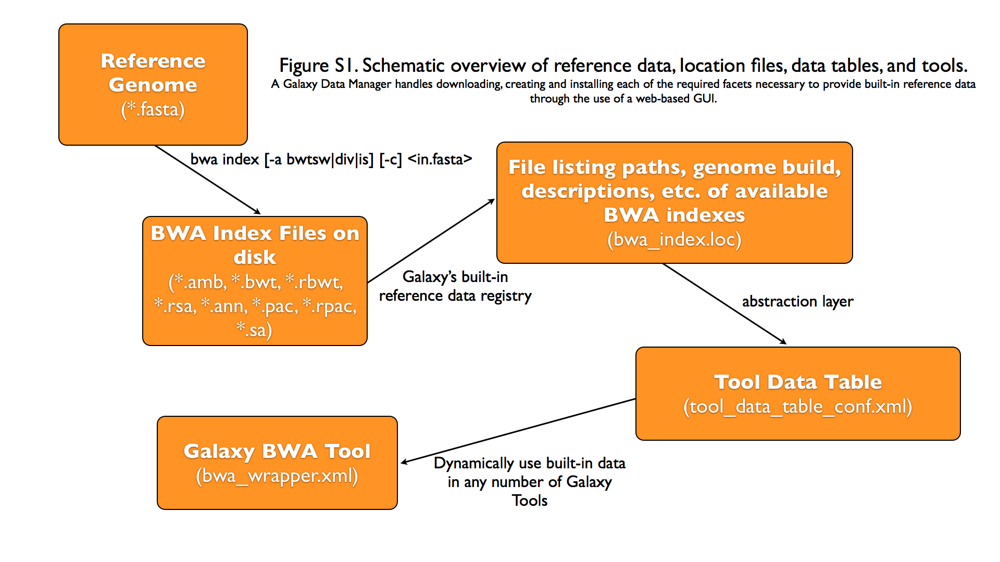
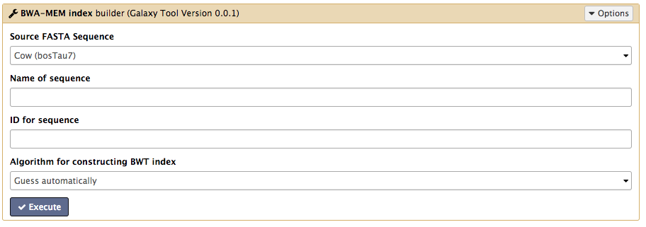
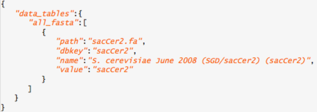
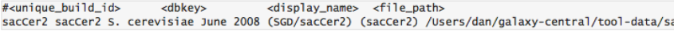
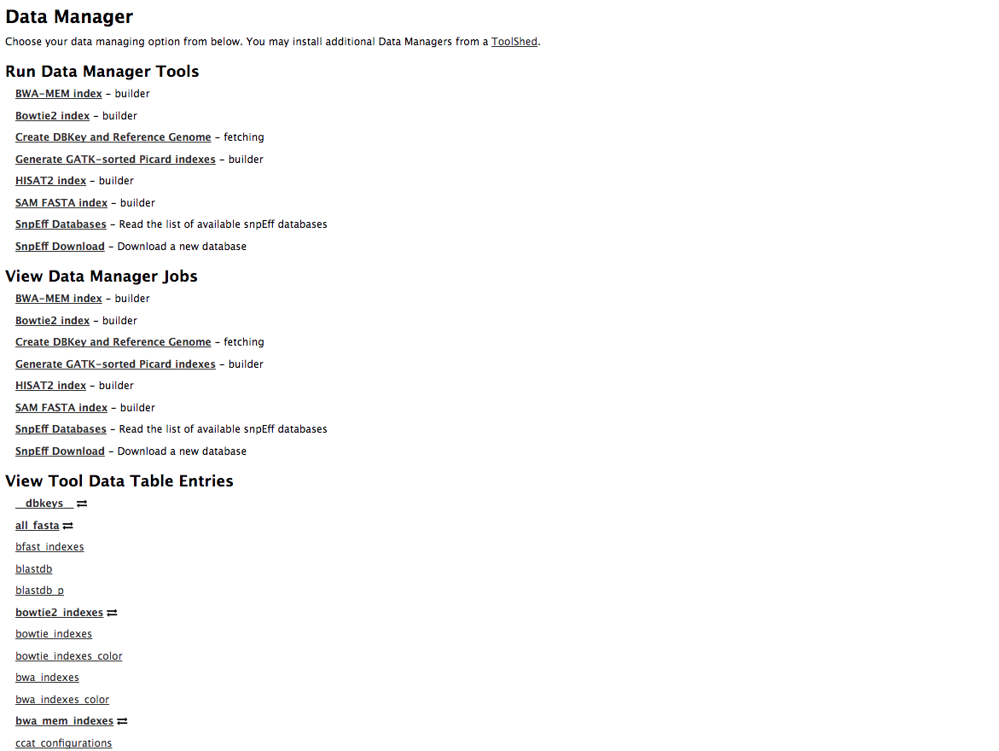
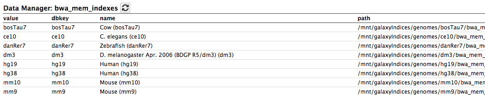

class: middle

# Defining and importing genomes, Data Managers

## EGDW 2017

Slides by SLG<br/>
Inspired by Galaxy Administrator Courses from [Dagobah](https://github.com/martenson/dagobah-training)

.footer[
https://github.com/igbmc/egdw2017
]

---

layout: true
name: title
class: middle

.footer[
EGDW 2017
]

---

layout: true
name: content

.footer[
EGDW 2017
]

---

layout: true
name: hands-on

.footer[
EGDW 2017 - **Hands-on**
]

---

layout: true
name: empty-footer

---

template: title

# Overview

* **Intro to built in datasets**
* Built in data hierarchy
* Some problems
* Data Managers

---
template: content

# Built in data



---
template: content

# Data, what data?

* Some genomes are large! Human, Mouse, Rat
* Some tools require indices of the genomes.
* The indices take a long time to build!
* Better to pre-build the indices.

---
template: title

# Overview
.large[
* Intro to built in datasets
* **Built in data hierarchy**
* Some problems
* Data Managers
]
---
template: content

# Data schematics in Galaxy

.smallimage[]

---
template: empty-footer
# Using reference data in a tool

#### bwa_wrapper.xml

``` xml
<conditional name="reference_source">
      <param name="reference_source_selector" type="select" label="Will you select a reference genome from your history or use a built-in index?" help="Built-ins were indexed using default options. See 'Indexes' section of help below">
        <option value="cached">Use a built-in genome index</option>
        <option value="history">Use a genome from history and build index</option>
      </param>
      <when value="cached">
        <param name="ref_file" type="select" label="Using reference genome" help="Select genome from the list">
          <options from_data_table="bwa_indexes">
            <filter type="sort_by" column="2" />
            <validator type="no_options" message="No indexes are available" />
          </options>
          <validator type="no_options" message="A built-in reference genome is not available for the build associated with the selected input file"/>
        </param>
      </when>
      <when value="history">

```

---
template: content
# Where are the data tables?

#### tool_data_table_conf.xml

(Usually located in `galaxy/config/`)

``` xml
  <tables>
    <!-- Locations of indexes in the BWA mapper format -->
    <table name="bwa_indexes" comment_char="#" allow_duplicate_entries="False">
      <columns>value, dbkey, name, path</columns>
      <file path="tool-data/bwa_index.loc" />
    </table>
  </tables>
```

---
template: content
# "loc" files - Short for location!

bwa_index.loc

``` text
...
#
#<unique_build_id>   <dbkey>   <display_name>   <file_path>
#
...

bosTau7 bosTau7 Cow (bosTau7)   /mnt/galaxyIndices/genomes/bosTau7/bwa_mem_index/bosTau7/bosTau7.fa
ce10    ce10    C. elegans (ce10)       /mnt/galaxyIndices/genomes/ce10/bwa_mem_index/ce10/ce10.fa
dm3     dm3     D. melanogaster Apr. 2006 (BDGP R5/dm3) (dm3)   /mnt/galaxyIndices/genomes/dm3/bwa_mem_index/dm3/dm3.fa
hg19    hg19    Human (hg19)    /mnt/galaxyIndices/genomes/hg19/bwa_mem_index/hg19/hg19.fa
hg38    hg38    Human (hg38)    /mnt/galaxyIndices/genomes/hg38/bwa_mem_index/hg38/hg38.fa
...
```

.callout.callout-warning[
Tab separated file!!
]

---
template: title

# Overview

* Intro to built in datasets
* Built in data hierarchy
* **Some problems**
* Data Managers

---
template: content

# Some Problems!

* Time consuming!
  * ~30 minutes work just to add a new genome to 1 tool!

* Administrator needs to know:
  * how to index **every** tool
  * expected format of the reference data
  * format of the .loc file

---
template: content

# Other concerns

* **Accessible?**
  * Manually download genome FASTA files
  * Download, compile, run bwa index; which options?
* **Reproducible?**
  * Only if the person performing manual steps keeps good notes
* **Transparent?**
  * Send email to sysadmin asking for notes
  * Restart Galaxy server for new entries

---
template: content

# Overview

* Intro to built in datasets
* Built in data hierarchy
* Some problems
* **Data Managers**

---
template: content

# Data Managers

* Allows for the **creation of built-in** (reference) data
	* underlying data
	* data tables
	* \*.loc files

* Specialized Galaxy tools that can only be accessed by an admin

* Defined **locally** or installed from **ToolShed**

---
template: content

# Data Managers

* **Flexible** framework
  * Not just genomic data
  * Run Data Managers through UI
  * Workflow compatible
  * API
* Examples
  * Adding new genome builds (dbkeys)
  * Fetching genome (fasta) sequences
  * Building short read mapper indices for genomes

---
template: content

# Special class of Galaxy tool

Looks just like a normal Galaxy tool!



---
template: content

# What does it do?

The output of the data manager is a JSON description of the new data table entry



This gets turned into a new data table entry



The index files themselves get placed in the appropriate location.

---
template: empty-footer

# Data Managers Admin

* Located on the Galaxy's Admin Tab under **Local Data**

.smallimage[]

---
template: content

# Data Managers Admin

* UI tools to fetch reference genomes/build indices
* View progress of index build jobs
* View contents of tool data tables


